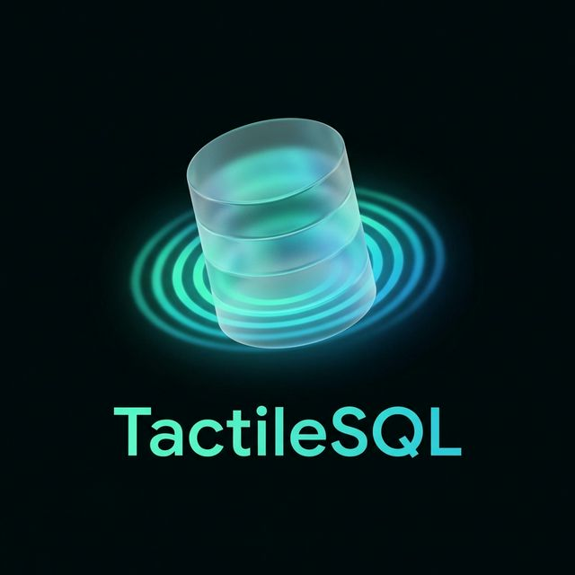

<p align="center">
  
</p>

# TactileSQL

TactileSQL is a modern, desktop-first SQL workbench for MySQL and PostgreSQL, built with Tauri 2 and vanilla JavaScript. It provides a rich SQL editing experience, schema tools, and operational dashboards in a fast, native shell.

## Highlights

- **SQL Workbench** with multi-tab editor, syntax highlighting, auto-format, autocomplete, and **code folding**.
- **First-Class ClickHouse Support**: Rich SVG **Visual Explain Pipeline** (parallelism & bottlenecks), Visual Explain AST, Advanced Table Inspector, Partition Explorer, Query Log Dashboard, Kafka Engine Monitoring, Materialized View Data Lineage, and **Merge & Mutation Monitor**.
- **Code Folding**: Collapse and expand code blocks (subqueries, CASE/END, BEGIN/END, block comments) for improved readability.
- **Configurable SQL Execution Defaults**: Set default run mode (`current statement` / `selection first` / `run all`) and query timeout (`0 = unlimited`).
- **Smart Autocomplete++** with context-aware suggestions, abbreviation matching (e.g. `tc` → `test_customers`), FK-based JOIN hints, database/schema qualification control (Never/Always/On collisions), and frequency learning.
- **Intelligent JOIN Statements**: Automatically generate complete JOIN clauses (e.g., `JOIN orders o ON u.id = o.user_id`) based on foreign key relationships, with automatic alias generation and reverse FK detection.
- **Expand Wildcard**: Replace `SELECT *` or `alias.*` with a comma-separated list of actual column names (`Ctrl+Shift+E`), automatically resolving potential name conflicts by qualifying ambiguous columns.
- **Query Audit Trail** for compliance tracking with exportable logs, statistics, and filtering.
- **Visual Explain** and **Query Profiler** for performance insights.
- **AI Assistant**: SQL generation and natural language query support powered by multiple providers (OpenAI, Gemini, Anthropic, DeepSeek, Groq, Mistral, and Local AI).
- **AI Query Assistance**: Step-by-step query explanation (**Shift+Click Explain**), performance optimization suggestions (**Right-Click Analyze**), and automated error fixing (**Fix with AI**).
- **AI Query Profiler Analysis**: One-click AI interpretation of query performance metrics with actionable optimization advice.
- **Robust Query Analysis**: Hardened `EXPLAIN` engine with query normalization (auto-semicolon stripping), verb validation, and PostgreSQL-specific DML support (`VALUES`, `EXECUTE`).
- **One-Click Performance Analysis**: Instantly trigger the Query Analyzer for active processes or slow query logs directly from the monitoring dashboard.
- **Latency prediction & slow-query early warning** based on historical execution patterns.
- **Parameter suggestions** using historical value distributions.
- **What‑If Optimizer** to compare query variants with estimated cost.
- **Index Lifecycle V2**: Detect unused indexes, run drop what-if simulations, compute confidence scores, and generate rollback SQL.
- **Similarity & workload profiling** to group duplicate query patterns.
- **SSH Tunnel Support** for secure database connections through SSH servers.
- **Editable Results Grid** with virtual scrolling, column visibility, CSV export, and clipboard copy.
- **Interactive Relational Data Exploration**: Navigate foreign keys directly from results with instant related data popups.
- **Object Explorer** with search functionality, databases, tables, views, triggers, procedures, functions, and events.
- **Object Explorer Display Controls**: Toggle visibility of system databases/schemas and improved responsive truncation for long object/column names.
- **Searchable Object Explorer**: Integrated search box to quickly find databases, tables, and columns with "Next/Prev" navigation and auto-expansion.
- **Enhanced Column Properties Tooltip**: Right-click on any column to view detailed properties (type, default, keys, extras) with theme-aware styling.
- **Schema Designer** for columns, indexes, foreign keys, triggers, DDL, and stats.
- **ER Diagram Editor**: Build schema relationship graphs, edit manual relations, hide/restore FK edges, save named layouts, and export as JSON/Mermaid/PNG/**GraphML**.
- **Schema Diff** for database or single-table comparison with generated sync SQL.
- **Data Compare** for row-level source/target table comparison with generated data sync SQL (`INSERT`/`UPDATE`/`DELETE`).
- **Data Import/Export Wizard** supporting CSV, SQL, and JSON formats with progress tracking.
- **Data Transfer/Migration Wizard**: Plan and run DB->DB and DB->file transfers with per-object mode (`append`, `replace`, `upsert`), sink type (`database`, `csv`, `jsonl`, `sql`), dry-run, and run monitoring.
- **Backup & Restore** with scheduled backups, compression, and full/incremental backup modes.
- **Task Center** for end-to-end task operations: create/edit tasks, filter by type/status/tag/owner, configure cron/interval/one-shot triggers with next-run preview, build composite DAG flows, run/cancel/retry executions, inspect run logs, and manage retention/purge (including `data_transfer_migration` tasks).
- **Mock Data Generator** with deterministic preview, async generation jobs, cancellation, and persisted job history.
- **Real-time Server Monitor** with live metrics for CPU, memory, connections, queries, and InnoDB status.
- **Lock/Deadlock Root-Cause Analysis**: Live lock graph, blocking chains, deadlock-cycle detection, and automatic mitigation suggestions with blocker-termination shortcuts.
- **Capacity Planner** charts now sync total/data/index storage, cache hit, and disk I/O series under one tooltip with hover-linked markers.
- **Schema Evolution Tracker**: Capture snapshots, detect drifts, and auto-generate migration scripts.
- **Online Schema Change Planner**: Strategy-aware migration planning for MySQL (`native`, `pt_osc`, `gh_ost`) and PostgreSQL (`postgres_concurrently`) with lock-risk warnings.
- **AI Schema Impact Analysis**: LLM-based downstream risk analysis for schema diffs with persistent snapshot-pair history.
- **Data Quality Analyzer**: Track data health scores, detect anomalies (NULLs, duplicates), and visualize quality trends.
- **Dependency Engine**: Visualize lineage between tables, views, and procedures with impact analysis for schema changes.
- **Density-aware Dependency Graph** with advanced zoom/pan controls, keyboard shortcuts, and a responsive mini-map for navigating large node/edge sets.
- **Routine-Aware Lineage**: Dependency extraction now includes procedure/function flows with `Select`, `Insert`, `Update`, `Delete`, and `Call` edges.
- **Blast Radius Mode**: Score and rank critical downstream objects for a selected node with hop-aware impact severity.
- **Edge Type Filters**: Toggle dependency links by `ForeignKey`, `Select`, `Insert`, `Update`, and `Delete` to isolate change paths.
- **Impact Path Finder**: Find shortest downstream paths between selected source objects and target nodes.
- **Optimized Dependency Graph UX**: Debounced indexed search, preview-first lineage loading, and viewer reuse for smoother large-graph navigation.
- **Faster Dependency Rebuilds**: Backend graph cache and duplicate-edge deduplication to reduce repeated extraction cost.
- **Data Lineage Screen**: Build query-history lineage with time windows (`1h/24h/7d/30d/custom/all`), parse coverage stats, and skip-reason breakdown.
- **Lineage View Modes**: Switch between `Full`, `Table + Query`, and `Table Only` graphs for dense workloads.
- **Weighted Lineage Edges**: Visualize edge strength by execution count, total duration, or average duration.
- **Lineage Exports**: Export lineage as JSON, Mermaid, or PNG; selected-node lineage supports focused Mermaid export.
- **Lineage Performance**: Graph construction runs in a Web Worker with main-thread fallback and timeout protection.
- **Connection Manager** with encrypted credential storage, connection testing, and SSH tunnel configuration.
- **MySQL User & Role Management**: Create/drop roles, grant/revoke roles to users, manage global privileges, and monitor account status (lock state, password expiry, last changed).
- **Access Control** viewer for MySQL users and privileges.
- **MySQL Version Intelligence**: Automatically detects MySQL version (5.7+ vs 8.0+) to provide compatible monitoring queries and feature fallbacks.
- **Table Maintenance Wizard**: Specialized Material Design interface for MySQL fragmentation analysis (`DATA_FREE` vs `DATA_LENGTH`) with one-click **ANALYZE**, **CHECK**, **OPTIMIZE**, or **REPAIR** operations.
- **Server-Wide Bloat Analysis**: Dedicated Maintenance dashboard to identify storage waste across all tables, prioritized by wasted bytes.
- **MySQL Slow Query Log Runtime Config**: Configure `slow_query_log`, `long_query_time`, `log_queries_not_using_indexes`, and `log_output` directly from the UI using `SET GLOBAL`.
- **Server Variables Inspector**: Browse and edit server configuration with a searchable, categorized interface for MySQL, PostgreSQL, and ClickHouse.
- **Themes**: Dark, Light, and Oceanic.
- **Global keyboard shortcuts** and shortcut help overlay.

## Tech Stack

- **Frontend**: Vite + Vanilla JS + Tailwind CSS
- **Desktop**: Tauri v2
- **Backend**: Rust + SQLx (MySQL + PostgreSQL)
- **State**: LocalStorage + Tauri app data directory

## Project Structure

```
index.html
vite.config.js
tailwind.config.js
postcss.config.js
src/
	main.js
	router.js
	index.css
	pages/
	components/
	utils/
src-tauri/
	Cargo.toml
	tauri.conf.json
	src/
```

## Prerequisites

- **Node.js** (LTS recommended)
- **Rust toolchain** (stable)
- **MySQL and/or PostgreSQL server** accessible from your machine
- **Tauri system dependencies** for your OS (see Tauri v2 docs)
- **SSH access** (optional) for remote database connections via SSH tunnel
- **Docker + Docker Compose** (optional, for data transfer integration tests)

## Setup

Install dependencies:

```
npm install
```

Run the web UI only (Vite):

```
npm run dev
```

Run the desktop app (Tauri):

```
npx tauri dev
```

Build for production:

```
npm run build
npx tauri build
```

Command contract report (frontend `invoke(...)` vs Rust handlers):

```
npm run contract:report   # refresh src/generated/command-contract.json
npm run contract:check    # fail on newly introduced missing backend commands
```

Data transfer coercion integration tests (MySQL + PostgreSQL via Docker Compose):

```
scripts/run-data-transfer-coercion-it.sh
```

Optional environment overrides:

- `TACTILE_IT_MYSQL_HOST`, `TACTILE_IT_MYSQL_PORT`, `TACTILE_IT_MYSQL_USER`, `TACTILE_IT_MYSQL_PASSWORD`, `TACTILE_IT_MYSQL_DATABASE`
- `TACTILE_IT_POSTGRES_HOST`, `TACTILE_IT_POSTGRES_PORT`, `TACTILE_IT_POSTGRES_USER`, `TACTILE_IT_POSTGRES_PASSWORD`, `TACTILE_IT_POSTGRES_DATABASE`, `TACTILE_IT_POSTGRES_SCHEMA`

## Core Screens

### Workbench

- Multi-tab SQL editor with autocomplete and syntax highlighting
- Configurable editor typography (font size + font family) and line wrapping (`off` / `on` / `word`)
- **AI Assistant (Ctrl+I)**: Generate SQL from natural language or edit existing queries.
- **AI Profiler Analysis**: Interpretation of performance metrics (Tmp tables, lock waits, etc.) with AI-driven recommendations.
- **Lock Graph + Blocking Chain View**: Query Profiler Locks tab now includes root blocker ranking, chain depth, deadlock flags, and automatic remediation guidance.
- Format SQL and explain plan with visual query analyzer
- Query optimization suggestions with index recommendations and index impact estimates
- Slow query early warning and latency estimates
- Parameter suggestions based on history
- What‑If Optimizer for variant comparisons
- Execution defaults for Run button / `Ctrl+Enter` and configurable query timeout per execution
- Query execution history and snippet library
- Results grid with filtering, selection, and inline editing
- Configurable max rows per query in results (`0 = unlimited`) with limit indicator when truncation is applied
- **Results Explorer**: Ctrl+Click on foreign keys to view referenced related data in popup
- **Object Explorer Search**: Quickly jump to any database, table, or column with a persistent search box, match navigation, and auto-expanding tree.
- **Table Maintenance**: Direct access to **ANALYZE**, **CHECK**, **OPTIMIZE**, and **REPAIR** (MySQL) or **VACUUM** (PostgreSQL) from the table context menu.
- **Find & Replace**: Full-featured search and replace in editor with Regex support, case sensitivity, and highlighting (`Ctrl+F` / `Ctrl+H`).

### Audit Trail

- Similar/duplicate query detection
- Workload profiling with auto-labeling (hot/slow/error-prone)

### Awareness Features

- **Query Comparator**: Visual diff of two queries with syntax highlighting and performance metric comparison (execution time, rows affected, etc.).
- **Anomaly Dashboard**: Detects and displays performance regressions by comparing current execution against historical baselines.
- **Performance Profiler**: Backend service that tracks query execution history and builds baseline profiles for anomaly detection.

### Data Lineage

- Build lineage from query execution history with configurable history limit and query-type/table filters
- Time-window filtering (`1h`, `24h`, `7d`, `30d`, `custom`, `all`) using bounded history range fetch
- Parse coverage telemetry with skipped-query reason buckets (empty/multi-statement/unsupported/no-table/filtered/parse-error)
- View modes: `Full (Query + Table + Column)`, `Table + Query`, `Table Only`
- Edge-weight overlays: `execution_count`, `total_duration_ms`, `avg_duration_ms`
- Deep-linkable node focus via hash param (`#/lineage?node=<id>`) and rich node detail sidebar
- Built-in blast radius ranking, path finder, and node-level lineage export
- Graph exports: full JSON, Mermaid, and PNG
- Worker-backed lineage graph build for smoother UI on large histories

### Dashboard

- KPIs: threads, buffer pool, traffic
- Database size overview
- Active process list

### Data Tools

- **Import Wizard**: Upload CSV, SQL, or JSON files with field mapping and preview
- **Export Tool**: Export databases or tables to CSV, SQL, or JSON formats
- **Transfer/Migration**: Plan cross-connection DB->DB or file-sink transfers with object-level controls (`append`/`replace`/`upsert`) and sink targets (`database`/`csv`/`jsonl`/`sql`)
- **Transfer Safety**: Optional schema-migration preflight (`includeSchemaMigration`) with strategy preview and Lock Guard enforcement for high-risk plans
- **Transfer Monitoring**: Dry-run support, live status polling, cancellation, and persisted run history
- **Transfer Mapping Validation**: Validate mapping/cast rules before execution and generate Task Center payload from a transfer plan
- **Backup Manager**: Schedule automated backups with compression and encryption
- **Restore Database**: Restore from previous backups with validation
- **Mock Data Generator**: Preview generated rows, run async generation/dry-run jobs, track progress, cancel running jobs, and review recent job history across restarts
- **Data Compare & Sync**: Compare two tables (source/target), select key & compare columns, review row-level diffs (`missing`, `extra`, `changed`), and generate sync SQL script

### Task Center

- Route: `#/tasks` (feature-flagged with `taskCenter`)
- Task definitions: create/edit/delete with JSON payload validation
- Task types: `sql_script`, `backup`, `schema_snapshot`, `data_compare_sync`, `data_transfer_migration`, `composite`
- Task list: live filtering (`type`, `status`, `owner`, `tag`) plus `last run` and `next run` summary columns
- Trigger editor: `interval`, `cron`, `one_shot` with client-side cron validation and next 5 run preview
- Composite builder: step management and dependency graph with cycle/dependency validation
- Run operations: `Run Now`, selected run `Cancel`, selected run `Retry`
- Observability: run history, run logs, composite step statuses, scheduler state controls
- Retention: configurable history retention days and manual purge action

Task Center docs:
- User guide: `docs/task-manager-user-guide-en.md`
- Technical guide: `docs/task-manager-technical-guide-en.md`
- Rollout checklist: `docs/task-manager-rollout-checklist-en.md`
- Payload examples: `docs/task-manager-payload-examples.md`
- Backlog import sample: `docs/data-transfer-task-center-import.json`

### Server Monitor

- **Unified Monitoring Dashboard**: Multi-tab interface for Processes, InnoDB Deep Dive, Slow Queries, Locks, Replication, Resource Usage, and Alerts.
- **Configurable Threshold Alerts**: Set custom metric thresholds (QPS, threads, slow queries) and receive real-time system notifications via Tauri.
- **Real-time & Historical Metrics**: Live CPU, memory, traffic (Bps), and QPS tracking with 30-second resolution background telemetry.
- **Historical Trend Analysis**: Persistent storage of performance metrics in local SQLite, enabling visualization of historical patterns upon startup.
- **AI-Driven Performance Analysis**: One-click "Ask AI Analysis" to get expert insights, bottleneck identification, and optimization suggestions based on current server health and metrics.
- **Advanced Postgres Stats**: Deep-dive metrics for PostgreSQL including Cache Hit Ratio, Index Hit Ratio, and Deadlock counters.
- **Visual Resource Heatmap**: Identify top resource-consuming tables with integrated read/write activity bars and latency signals.
- **Safe Mitigation**: Kill runaway or blocking sessions directly from the process list or lock graph.

### Schema Designer

- Manage columns, indexes, foreign keys, constraints, triggers
- View DDL and table stats
- SQL draft panel for ALTER statements
- Diagram tab includes a quick **Open in ER Diagram** handoff for full graph editing

### ER Diagram

- Build ER graph by selected connection + database/schema (optional view nodes)
- Edit relationship overlays: add/delete manual edges, inline label/cardinality updates
- Hide built-in FK edges and restore them individually
- Save/load/delete named layouts (positions + edge overrides) per connection and scope
- Export graph as JSON, Mermaid, PNG, and GraphML

### Schema Diff

- Compare source/target databases or single tables
- Generate sync SQL for create/alter/drop
- Select online migration strategy (MySQL: `native`, `pt_osc`, `gh_ost`; PostgreSQL: `postgres_concurrently`, `native`)
- Review lock-risk warnings and use Lock Guard confirmation before copying high-risk outputs
- Generate external OSC command templates for MySQL when `pt_osc`/`gh_ost` strategy is selected

### Index Lifecycle

- Detect unused / low-utility indexes from usage stats and cardinality signals
- Generate non-destructive drop plans for selected indexes
- Run what-if drop simulation against historical query workload
- Review query-level regression deltas, coverage ratio, and confidence score
- Copy rollback SQL for safer rollback planning

- **Connection Manager** with encrypted credential storage, connection testing, and SSH tunnel configuration.
- **Server Variables**: Full-screen, searchable inspector for server configuration settings with session-level editing support (`SET SESSION`).
- **Color-coded connection groups**

### Access Control

- View MySQL users
- Inspect global and database privileges

### Settings

- Theme selection
- Editor font size and font family
- Editor line wrap mode (`off`, `on`, `word`)
- Execution default run mode (`current statement`, `selection first`, `run all`)
- Execution query timeout in seconds (`0 = unlimited`)
- Results max rows per query (`0 = unlimited`)
- Object Explorer system databases/schemas visibility toggle
- Autocomplete qualification mode (`never`, `always`, `collisions`) and profiler preferences

## Advanced Insights

### Schema Evolution Tracker
- **Snapshots**: Capture database state at any point in time.
- **Diff Viewer**: Visual comparison between snapshots showing added/dropped/modified tables and columns.
- **Migration Generation**: Automatically generates SQL scripts to migrate between versions.
- **Online Change Wizard**: Strategy-aware planning with MySQL `pt_osc`/`gh_ost` command templates and PostgreSQL `CONCURRENTLY` index DDL mode.
- **Lock Risk Warnings**: Surfaces low/medium/high lock risk heuristics for generated statements before execution.
- **Lock Guard**: Extra confirmation prompt before copying plans with high lock-risk warnings.
- **Breaking Change Detection**: Alerts on destructive changes (drops, type changes).
- **AI Impact Analysis**: Generates risk summaries and mitigation plans for each schema diff, saved per snapshot pair.

### Data Quality Analyzer
- **Health Score**: 0-100 score based on NULL rates, duplicates, and constraints.
- **Issue Tracking**: Detailed list of quality violations per table.
- **Timeline Integration**: View quality scores historically alongside schema changes.
- **AI Quality Insights**: AI-generated risk summaries, root-cause hypotheses, remediation plans, and validation checks stored alongside each table report.

### Dependency Engine
- **Visual Graph**: Interactive node-link diagram of database dependencies.
- **Impact Analysis**: Identify downstream objects affected by a proposed change.
- **Blast Radius Scoring**: Rank impacted downstream nodes by distance, fanout, dependency degree, object type, and quality risk.
- **Routine Coverage**: Includes tables, views, procedures, and functions with typed `Select`/`Insert`/`Update`/`Delete`/`Call`/`ForeignKey` links.
- **Edge Type Filters**: Filter graph links by `ForeignKey`, `Select`, `Insert`, `Update`, and `Delete`; lineage, search, and blast radius stay filter-aware.
- **Focus Hops**: Focused table graphs support configurable multi-hop neighborhood depth.
- **Impact Path Finder**: Resolve shortest downstream path from selected node to a target label/id within a configurable hop budget.
- **Adjustable Blast Cutoff**: Blast radius scoring supports runtime hop cutoff tuning from the details panel.
- **Quality Overlay**: Color-coded graph nodes based on data quality scores.
- **Scalable Interaction**: Debounced indexed search, lazy lineage payloads, and viewer reuse for dense graphs.
- **Backend Acceleration**: In-memory graph cache and duplicate-edge deduplication for faster rebuilds.
- **Telemetry Hooks**: Emits `tactilesql:graph-metric` events (search latency, payload size, viewer reuse) for diagnostics.
- **Mermaid Export**: Export the dependency graph as a mermaid diagram for external documentation.

### Data Lineage
- **History-Driven Graph**: Builds lineage from query execution history (`exact_query`) with query-hash aggregation.
- **Time Range API**: Uses `get_query_history_range(start, end, limit)` for bounded lineage windows and `get_query_history(limit)` for all-time mode.
- **AST-Like Heuristics**: Improved parsing for CTE aliases, top-level `SELECT` projection extraction, and column-level read/write inference.
- **Coverage Metrics**: Shows included vs skipped query counts with categorical skip reasons and coverage percentage.
- **View Switching**: Toggle between full graph and table-centric graph variants to control density.
- **Edge Metrics**: Carries per-edge execution count, total duration, and average duration into the graph renderer.
- **Export Tooling**: Supports JSON, Mermaid, and PNG export from the lineage page.
- **Web Worker Build Path**: Offloads lineage graph construction to a dedicated worker and falls back to main thread on failure.

## Backend Commands (Tauri)

The Rust backend exposes the following commands (used by the UI):

### Connection Management
- `test_connection`, `establish_connection`, `disconnect`, `get_active_db_type`
- `load_connections`, `save_connection`, `save_connections`, `delete_connection`
- `test_ssh_connection` — Validate SSH host/auth settings
- `open_ssh_tunnel`, `close_ssh_tunnel` — Manage SSH local-forward tunnel lifecycle

### Query Execution
- `execute_query` — Execute SQL statements
- `analyze_query` — Analyze query performance and get optimization suggestions
- `simulate_index_drop` — Run index drop what-if simulation and return rollback SQL + confidence metrics

### Awareness Features
- `compare_queries` — Compare syntax and performance of two queries
- `get_anomaly_history` — Retrieve history of detected performance anomalies
- `get_query_history` — Retrieve execution history for specific queries
- `get_query_history_range` — Retrieve execution history within a start/end time window

### Database Schema
- `get_databases`, `get_tables`, `get_table_schema`
- `get_table_indexes`, `get_table_foreign_keys`, `get_table_primary_keys`, `get_table_constraints`, `get_table_stats`, `get_table_ddl`
- `get_views`, `get_view_definition`, `alter_view`
- `get_triggers`, `get_table_triggers`
- `get_procedures`, `get_functions`, `get_events`
- `save_ai_impact_report`, `get_ai_impact_report`
- `save_quality_ai_report`, `get_quality_ai_report`

### ER Diagram
- `build_er_graph` — Build ER graph payload from live schema metadata
- `save_er_layout`, `get_er_layout`, `list_er_layouts`, `delete_er_layout` — Persist and manage named ER layouts

### Schema Tracker
- `capture_schema_snapshot`, `get_schema_snapshots`
- `compare_schema_snapshots`, `detect_breaking_changes`
- `generate_migration`, `generate_migration_plan`
- `add_snapshot_tag`

### Data Tools
- `export_table_csv`, `export_table_json`, `export_table_sql` — Export table data
- `import_csv` — Import CSV rows into a selected table
- `preview_data_transfer_plan` — Build transfer plan preview + warnings + optional schema preflight summary
- `start_data_transfer` — Start transfer run (supports dry-run)
- `get_data_transfer_status` — Fetch transfer run status/progress by operation id
- `list_data_transfer_runs` — List recent transfer runs from local run store
- `cancel_data_transfer` — Request cancellation for an active transfer run
- `validate_data_transfer_mapping` — Validate mapping/cast rules for transfer columns
- `generate_transfer_task_payload` — Generate `data_transfer_migration` Task Center payload from plan request
- `preview_mock_data` — Generate sample rows without writing to DB
- `start_mock_data_generation` — Start async mock data generation (supports dry-run)
- `get_mock_data_generation_status` — Poll status/progress for one generation job
- `list_mock_data_generation_history` — List recent mock generation jobs (persisted locally)
- `cancel_mock_data_generation` — Request cancellation for an active generation job
- `compare_table_data` — Compute row-level diff between source/target tables
- `generate_data_sync_script` — Generate `INSERT`/`UPDATE`/`DELETE` sync SQL plan from compare result inputs
- `backup_database` — Create SQL backup output (schema + optional data)
- `restore_database` — Execute SQL backup file against active connection

### Monitoring
- `get_server_status` — Server status counters and runtime metrics
- `get_monitor_snapshot` — Unified snapshot of all monitoring telemetry
- `get_monitor_history` — Retrieve historical server metrics for trend analysis
- `get_bloat_analysis` — Server-wide fragmentation/waste scan for MySQL and PostgreSQL
- `get_process_list` — Active backend/session list
- `kill_process` — Terminate blocking or runaway sessions
- `get_locks` — Raw lock inventory (engine lock metadata)
- `get_lock_analysis` — Blocking graph, chain/deadlock analysis, and automatic recommendations
- `get_slow_queries` — Slow query samples with timing stats
- `get_innodb_status` — InnoDB storage engine status
- `get_replication_status` — Replication health/status snapshot

### ClickHouse Commands
- `get_clickhouse_server_status` — ClickHouse server status and uptime
- `get_clickhouse_table_info` — Detailed MergeTree table properties
- `get_clickhouse_partitions`, `manage_partition` — Partition management
- `get_clickhouse_query_log` — Query performance statistics
- `get_clickhouse_kafka_tables`, `get_clickhouse_kafka_consumers` — Kafka engine monitoring
- `get_clickhouse_merges`, `get_clickhouse_mutations` — Merge and mutation monitoring
- `get_clickhouse_data_lineage` — Materialized view dependency extraction

### User Management
- `get_users`, `get_user_privileges` — Basic user and privilege inspection
- `manage_privilege` — GRANT and REVOKE global/database privileges
- `manage_user_status` — Lock or unlock user accounts
- `manage_role`, `get_role_edges` — MySQL 8.0+ role lifecycle and assignment management

### ClickHouse Advanced Features
- **Visual Explain Plan**: Interactive SVG flow diagrams for `EXPLAIN PIPELINE` featuring processor classification, parallelism (×N) extraction, and bottleneck detection; plus visual tree plans for `EXPLAIN AST`.
- **Advanced Table Inspector**: Detailed view of MergeTree properties, storage policy, data paths, and metadata.
- **Partition Explorer**: Manage partitions (view stats, detach, drop) directly from the UI.
- **Query Log Dashboard**: Visualize server performance metrics (duration, memory, read rows) derived from `system.query_log`.
- **Kafka Engine Monitoring**: Real-time dashboard for Kafka consumer groups, displaying offset lag, current offsets, and consumption errors.
- **Materialized View Data Lineage**: Interactive graph visualization of data flow between source tables and target tables through Materialized Views.
- **Merge & Mutation Monitor**: Live tracking of background merges and mutation history (ALTER UPDATE/DELETE) with progress bars and status badges.

## Keyboard Shortcuts

Common shortcuts (see the in-app help with `F1`):

### Query
- `Ctrl+Enter` / `F5` — Execute selected text or current statement
- `Ctrl+Shift+Enter` — Execute all statements in the editor

### Tabs
- `Ctrl+N` — New tab
- `Ctrl+W` — Close tab
- `Ctrl+Tab` / `Ctrl+Shift+Tab` — Next/previous tab
- `Ctrl+1` … `Ctrl+5` — Jump to tab

### Editor
- `Ctrl+Shift+F` — Format SQL
- `Ctrl+/` — Toggle comment
- `Ctrl+S` — Save as snippet
- `Ctrl+Space` — Autocomplete
- `Shift+F6` — Rename symbol (alias/CTE)
- `Ctrl+Shift+E` — Expand wildcard (*)
- `Ctrl+I` — Ask AI Assistant
- `Ctrl+Shift+[` — Fold all regions
- `Ctrl+Shift+]` — Unfold all regions

### Search & Replace
- `Ctrl+F` — Find
- `Ctrl+H` — Find and Replace
- `F3` / `Shift+F3` — Find Next/Previous Match
- `Alt+R` — Toggle Regex
- `Alt+C` — Toggle Case Sensitivity

### Navigation
- `Ctrl+Shift+O` — Focus Object Explorer
- `Ctrl+Shift+Q` — Focus Query Editor
- `Ctrl+Shift+R` — Focus Results
- `Ctrl+Shift+S` — Focus Snippets

### Tools
- `Ctrl+Shift+P` — Toggle Query Profiler

### General
- `F1` — Shortcut help
- `Esc` — Close active modal

## Data Storage
**Connection profiles** are stored in the **Tauri app data directory** as `connections.json`.
- **Backup files** are stored in `<app-data>/backups/` directory.
- **Feature stores and mock job history** are stored in `<app-data>/storage/local.db` (SQLite, WAL mode).
- **SSH keys** and credentials are encrypted with AES-256-GCM.
- **Passwords** are encrypted before saving (AES-256-GCM in Rust).

> Note: The encryption key is currently a static constant in [src-tauri/src/db.rs](src-tauri/src/db.rs). For production use, replace this with a key derived from the OS keychain or a user-provided secret.

## Security Features

- **Encrypted Credentials**: All database passwords and SSH credentials are encrypted at rest
- **SSH Tunnel Support**: Secure connections through SSH bastion hosts
- **Key-based Authentication**: Support for SSH private key authentication
- **Connection Pooling**: Secure, reusable connection pools
- **Backup Encryption**: Optional encryption for database backups
> Note: The encryption key is currently a static constant in [src-tauri/src/db.rs](src-tauri/src/db.rs). For production use, replace this with a key derived from the OS keychain or a user-provided secret.

## Window Behavior

- Frameless window with custom title bar and window controls.
- Minimum window size: **1280 × 800**.
- Custom resize handles (native resizing disabled).

## Troubleshooting

- **No data / errors on dashboards**: verify an active connection is set in the Connections page.
- **Connection refused**: ensure MySQL is running and reachable at host/port.
- **Tauri build issues**: verify system dependencies from Tauri v2 documentation.

## Recommended IDE Setup

- [VS Code](https://code.visualstudio.com/) + [Tauri](https://marketplace.visualstudio.com/items?itemName=tauri-apps.tauri-vscode) + [rust-analyzer](https://marketplace.visualstudio.com/items?itemName=rust-lang.rust-analyzer)
